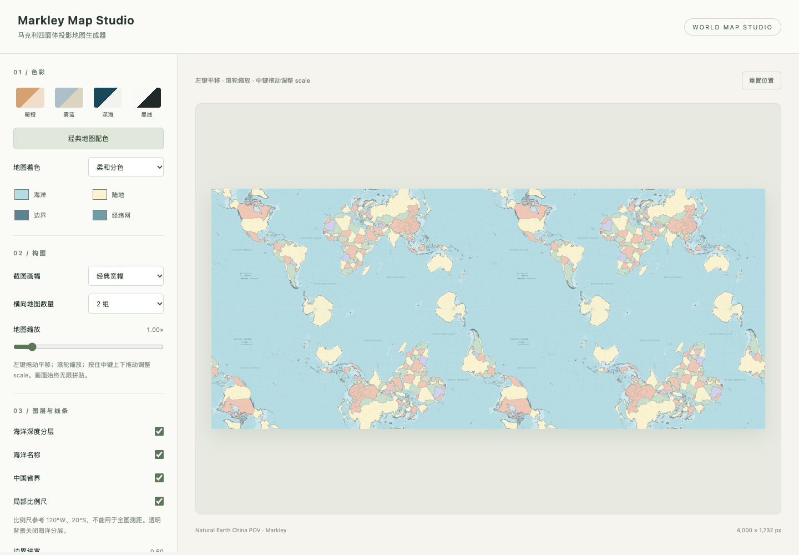

# Markley Map Studio

**Live:** https://markley-map-studio.pages.dev/

A static, offline world-map poster generator with an infinitely repeating Markley tetrahedral conformal layout. Built from real Natural Earth geography, with no AI-generated map geometry.



## Features

- A classic atlas preset, soft or vintage country colors, generalized ocean depth shading and ocean names, China internal province lines, and a local scale bar. Neighboring countries receive distinct colors. The scale bar is calibrated only at 120°W, 20°S; it is not valid everywhere on this variable-scale projection.
- Four artistic palettes and custom sea, land, border, and graticule colors.
- Shared topological boundaries drawn once, with consistent stroke widths.
- Configurable graticule spacing, thickness, and opacity.
- Custom output width and height, aspect lock, and resolution presets.
- Left-drag pan, wheel zoom, and middle-button vertical drag to adjust scale.
- Canvas preview reuses a rasterized map cell during pan. Zoom previews are throttled to roughly 30 updates per second using the existing cell. Zoom completion and viewport resize regenerate the cell at the settled scale with fixed 2x pixel density (map-cell width up to 12,288 px); PNG/SVG export uses full vector geography.
- Infinite tiling and a rectangular repeat-unit export mode.
- PNG and SVG export, including transparent oceans. PNG exports above 40 million pixels are blocked to avoid excessive memory use.
- Data-source and learning-only notice, with acknowledgement before every PNG/SVG download.
- A single self-contained HTML file: works offline without requests to external servers.

## Run

Requires Node.js 22 or newer.

```sh
npm ci
npm run build
```

Open `dist/index.html` directly in a browser. The built HTML is committed for easy downloading. After editing `src/`, run the build again.

```sh
npx playwright install chromium
npm test
```

To use an existing Chrome installation, set `CHROME_PATH` to its executable. Tests cover PNG dimensions, SVG export, pan/reset, wheel and middle-button zoom, infinite tiling, palettes, graticules, transparency, offline requests, mobile overflow, and pan without rebuilding geometry and redraw only after zoom ends.

## Cloudflare Pages

The live site uses dashboard Direct Upload. Source pushes do not automatically deploy to Cloudflare.

For dashboard Direct Upload, upload the contents of `dist/` (or a ZIP containing those files at its root). For Git integration, use production branch `main`, build command `npm run build`, output directory `dist`, and Node.js 22.

A Pages configuration is included in `wrangler.jsonc`. After signing in with Wrangler:

```sh
npx wrangler pages deploy dist --project-name markley-map-studio --branch main
```

Direct Upload and Git-integrated Pages projects have different setup flows. This repository's CI verifies builds and exports; it does not contain Cloudflare credentials.

## Geography and projection

Geography: Natural Earth 5.1.1, 1:10m, China POV, reduced into a shared topology. Taiwan, Hong Kong, and Macao are unified with the CHN feature. Supplementary South China Sea segments and island/reef markers are included. See [the correction record](data/README.md) for data sources, processing, tests, and known limits.

This is a third-party China-POV correction, **not an officially approved Chinese map**. The source supplies nine South China Sea segments; Chinese-standard East China Sea geometry and a full official-standard check are still outstanding. No map-review number is claimed.
Projection: Lee's conformal tetrahedral map, rearranged into Markley's periodic rectangular layout. The face projection is provided by `d3-geo-polygon`; this project implements net normalization, reflection, periodic wrapping, clipping, and repeated placement.

References:

- [Markley's tetrahedral map, Fil](https://observablehq.com/@fil/markley) — mathematical and visual reference.
- [D3 geo polygon](https://github.com/d3/d3-geo-polygon) — licensed projection implementation.
- [Natural Earth](https://www.naturalearthdata.com/) — geographic data.
- [China correction record](data/README.md) — source versions, official island coordinate references, processing, and limits.

## License

Project code: MIT. Natural Earth data: public domain. Bundled dependencies retain their original licenses; full notices are in `THIRD_PARTY_NOTICES.txt`, embedded in the offline HTML, and copied into `dist/`.

---

基于真实地理数据的马克利四面体保角投影拼接地图工具。支持艺术配色、经纬网、无限拼贴、自定义分辨率、中键缩放，以及 PNG / SVG 下载。构建后直接打开 `dist/index.html`，无需服务器或联网。
